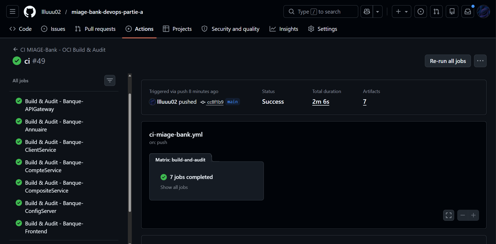
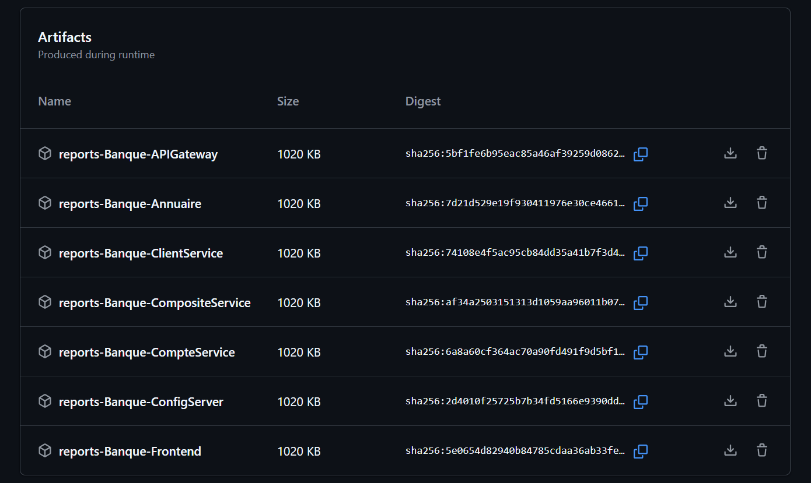
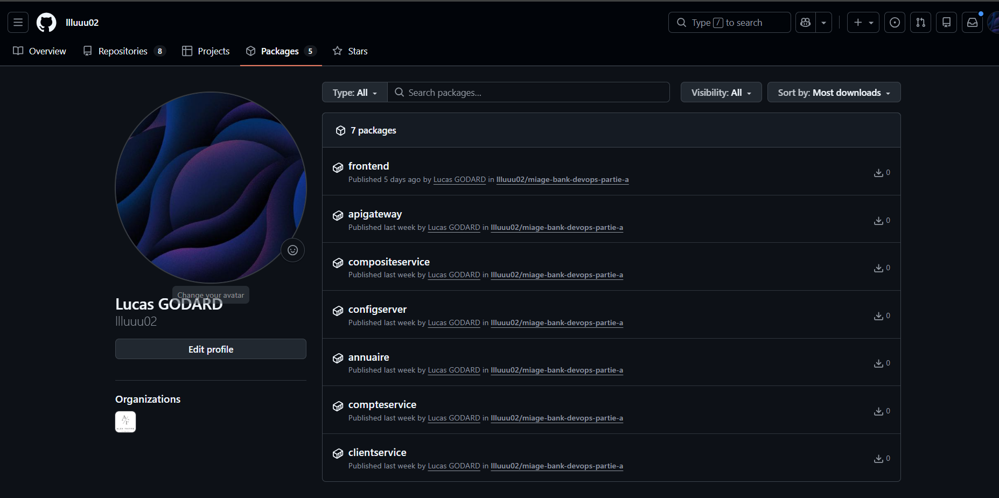

# Chaîne CI intégrée (GitHub Actions)

## Objectif

Assembler les étapes de la Partie A dans une pipeline GitHub Actions reproductible
qui, pour chaque composant de MIAGE-Bank : lint le Containerfile, build l'image
via Buildah, scanne avec Trivy, audite avec Dive, produit les rapports dans
`build-reports/` (exportés en artifacts) et publie l'image sur GHCR.

Fichier : `.github/workflows/ci-miage-bank.yml` (copie dans ce dossier).
Nom du workflow : **CI MIAGE-Bank - OCI Build & Audit**.

## Déclenchement et permissions

```yaml
on:
  push: ...                 # déclenchement sur push
permissions:
  contents: read
  packages: write           # nécessaire pour pousser sur ghcr.io
```

## Structure de la pipeline

Job **Build & Audit** exécuté en **matrice** (un run par `module`), sur
`ubuntu-22.04`. Pour chaque module, l'enchaînement réel des étapes est :

1. **Checkout** du code.
2. **Préparation de l'environnement** + **calcul des noms d'image** :
   `ghcr.io/<owner>/miage-bank-devops-partie-a/<service>:7.0`.
3. **Lint Containerfile — Hadolint** (`hadolint/hadolint-action@v3.1.0`).
4. **Build Buildah** : `./scripts/build-buildah.sh <module>`, puis export de
   l'image en archive : `buildah push ... docker-archive:images/containerfile-version/<svc>.tar`.
5. **Installation des outils d'audit** : Trivy (script officiel) + Dive (v0.12.0).
6. **Rapports Trivy** : `./scripts/scan-trivy.sh build-reports/<svc>.tar ...`
   (génère JSON + SARIF dans `build-reports/`).
7. **Gate de sécurité Trivy** :
   ```bash
   trivy image --input build-reports/<svc>.tar \
     --severity CRITICAL --ignore-unfixed --exit-code 0 --no-progress
   ```
   > La gate est **volontairement non bloquante** (`--exit-code 0`) et ignore les
   > CVE sans correctif (`--ignore-unfixed`) : les CVE CRITICAL résiduelles
   > proviennent des dépendances Java héritées et n'ont pas de fix applicable sans
   > refonte de l'appli (voir `../03 .../Trivy.md`). Le rapport est néanmoins
   > toujours produit.
8. **Audit Dive** : `./scripts/audit-dive.sh build-reports/<svc>.tar ...`
   (seuils efficacité 95 % / 20 Mo / 10 % — toutes les images PASS).
9. **Connexion GHCR** (`buildah login` avec `${{ secrets.GITHUB_TOKEN }}`) — `if push`.
10. **Tag + Push** de l'image vers GHCR — `if push`.
11. **Export des rapports** : `actions/upload-artifact@v4`, artifact
    `reports-<module>` (contient `build-reports/`).

## Récupération des livrables

Les rapports sont disponibles en **artifacts** du run GitHub Actions
(`reports-<service>.zip`), contenant pour chaque image :
`trivy_<svc>.json`, `trivy_<svc>.sarif`, `trivy_<svc>.txt`, `dive_<svc>.txt`.

## Résultat

- Pipeline verte sur les 7 modules (6 services Java + frontend) -> [Voir le workflow CI sur GitHub Actions](https://github.com/llluuu02/miage-bank-devops/actions/workflows/ci-miage-bank.yml)
- Images publiées : [Voir les images GHCR](https://github.com/llluuu02?tab=packages&repo_name=miage-bank-devops)
- Rapports Trivy + Dive archivés





## Livrables

- `ci-miage-bank.yml` — le workflow complet (ce dossier)
- Artifacts `reports-*` — rapports Trivy + Dive des 7 images
