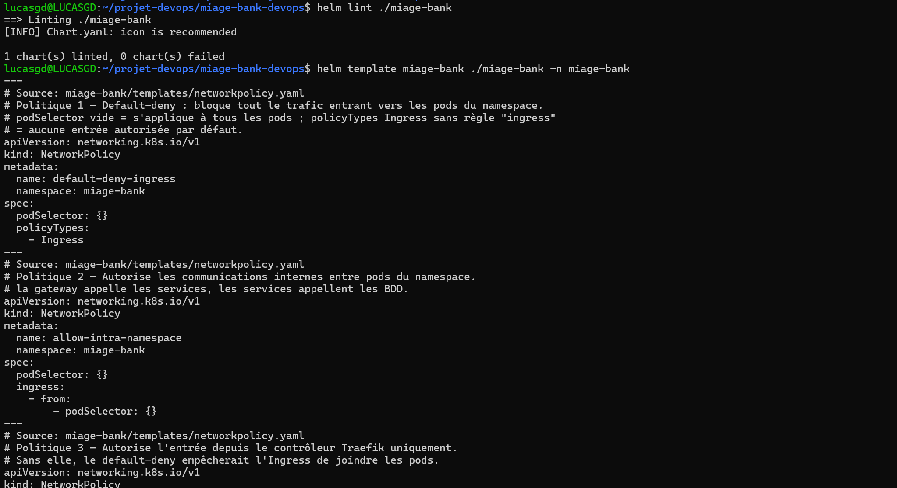
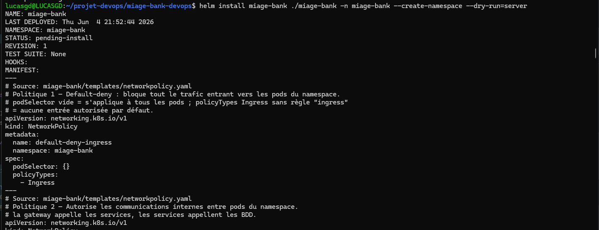

# Chart Helm pour MIAGE-Bank

---

## Structure du chart Helm

```
miage-bank/
├── Chart.yaml
├── values.yaml               # Values par defaut
├── values-prod.yaml          # Surcharge pour la prod
└── templates/
    ├── _helpers.tpl
    ├── deployment.yaml       # 6 micro-services + frontend
    ├── service.yaml          # Services ClusterIP
    ├── ingress.yaml          # Ingress classe traefik pour exposer l'API et le frontend
    ├── configmap.yaml        # Config non sensible
    ├── networkpolicy.yaml    # default-deny + intra-namespace + from-traefik
    ├── serviceaccount.yaml   # 1 ServiceAccount par service (least privilege)
    ├── secretstore.yaml      # SecretStore Vault (ESO)
    ├── externalsecrets.yaml  # ExternalSecret par service à base de données (Client + Compte)
    └── databases.yaml        # MySQL + MongoDB (Deployment + Service + PVC)
```

> Le template `namespace.yaml`
> a été retiré du chart. Un chart ne peut pas créer le namespace dans lequel il
> se déploie lui-même. La création du namespace est donc déléguée à Helm (`--create-namespace`) 
> via la commande `helm install`, et en GitOps à ArgoCD (`syncOptions: CreateNamespace=true`).

---

## Installation avant de valider le Chart

```bash
# External Secrets Operator
helm repo add external-secrets https://charts.external-secrets.io
helm repo update
helm install external-secrets external-secrets/external-secrets \
  -n external-secrets --create-namespace --set installCRDs=true

# Vault
helm repo add hashicorp https://helm.releases.hashicorp.com
helm install vault hashicorp/vault -n default \
  --set "server.dev.enabled=true" --set "server.dev.devRootToken=root"
# Création des mots de passe dans Vault
kubectl -n default exec vault-0 -- sh -c '
  vault kv put secret/miage-bank/clientservice username=client_user password=root!
  vault kv put secret/miage-bank/compteservice username=compte_user password=root
'

# Traefik
helm repo add traefik https://traefik.github.io/charts
helm repo update
helm install traefik traefik/traefik -n traefik --create-namespace
```

---

## Validation du chart

Les trois validations demandées par le sujet :

```bash
helm lint ./miage-bank
helm template miage-bank ./miage-bank -n miage-bank
helm install miage-bank ./miage-bank -n miage-bank \
  --create-namespace --dry-run=server
```




---

## Points de conception notables

- **Un seul `deployment.yaml`** génère les 7 déploiements via une boucle sur
  `.Values.microservices`, chaque service étant piloté par des flags
  (`secret`, `springApp`, `disableConfigImport`, `healthPath`, `startup`…).
- **Bases packagées dans le chart** (`databases.yaml`) avec PVC, consommant les
  **mêmes Secrets ESO** que les applications → Vault = source unique.
- **`values-prod.yaml`** : profil de production (à appliquer avec
  `-f values.yaml -f values-prod.yaml`).
