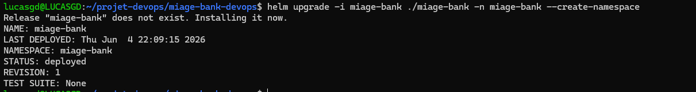
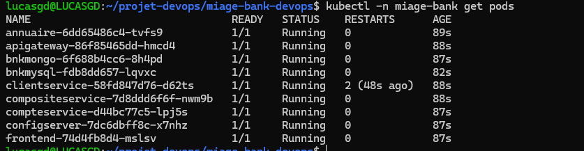
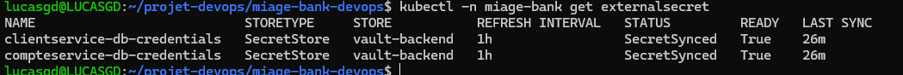
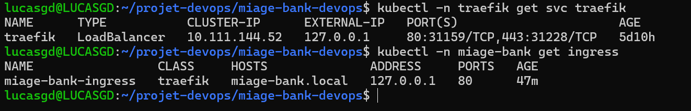
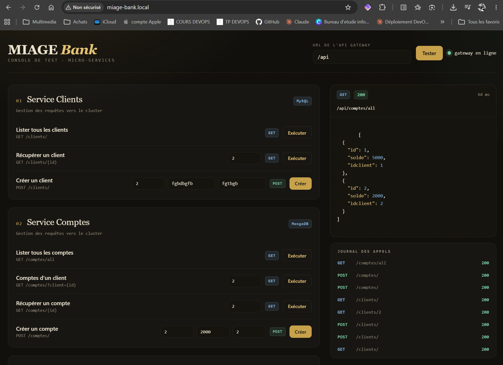
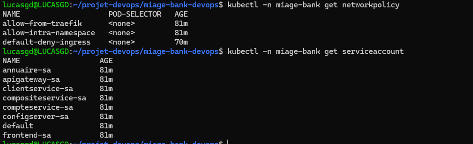

# Déploiement dans Kubernetes

---

## Déploiement

```bash
helm upgrade -i miage-bank ./miage-bank -n miage-bank --create-namespace
kubectl -n miage-bank get pods
```




---

## Gestion des secrets (Vault + ESO)

Les secrets de base de données ne figurent pas en clair dans le chart.

```
Vault (secret/miage-bank/<service>)
   └──> SecretStore "vault-backend" (auth par token)
        └──> ExternalSecret <service>-db-credentials
             └──> Secret Kubernetes <service>-secret (généré par ESO)
                  └──> injecté dans le Deployment ET dans la base de données
```

Seuls `clientservice` (sur MySQL) et `compteservice` (sur MongoDB) possèdent une base,
donc seuls ces deux services possèdent un `ExternalSecret`.

```bash
# vérifier les statuts des deux externalsecrets
kubectl -n miage-bank get externalsecret
```


---

## Particularité MongoDB

`compteservice` possède une configuration MongoDB via une URI unique construite à
partir du Secret ESO :

```
SPRING_DATA_MONGODB_URI = mongodb://<user>:<password>@bnkmongo:27017/banquebd?authSource=admin
```

---

## Exposition via Ingress Traefik

```bash
# donne une IP au LoadBalancer Traefik
minikube tunnel

# vérifier external-ip
kubectl -n traefik get svc traefik
# vérifier adresse
kubectl -n miage-bank get ingress

# résolution du hostname linux
echo "127.0.0.1 miage-bank.local" | sudo tee -a /etc/hosts

# résolution du hostname windows
Add-Content C:\Windows\System32\drivers\etc\hosts "`n127.0.0.1 miage-bank.local"
```

L'Ingress déclare sa classe via `spec.ingressClassName: traefik`. Le hostname est configuré dans `Values.yaml`.



Capture du frontend affiché dans le navigateur sur http://miage-bank.local/ :


---

## Sécurité réseau et RBAC

- **NetworkPolicy** : `default-deny-ingress` bloque tout le trafic entrant du
  namespace, puis `allow-intra-namespace` autorise les communications internes et
  `allow-from-traefik` autorise uniquement le contrôleur Traefik.
- **RBAC** : chaque micro-service dispose de son propre `ServiceAccount`
  (`<service>-sa`), avec `automountServiceAccountToken: false` (least privilege).
- **Probes** : `liveness` + `readiness` sur `/actuator/health`. Le config server,
  plus long à démarrer (clone d'un dépôt Git au boot), dispose en plus d'une
  `startupProbe` et d'un `timeoutSeconds` élargi pour éviter les redémarrages
  prématurés.

