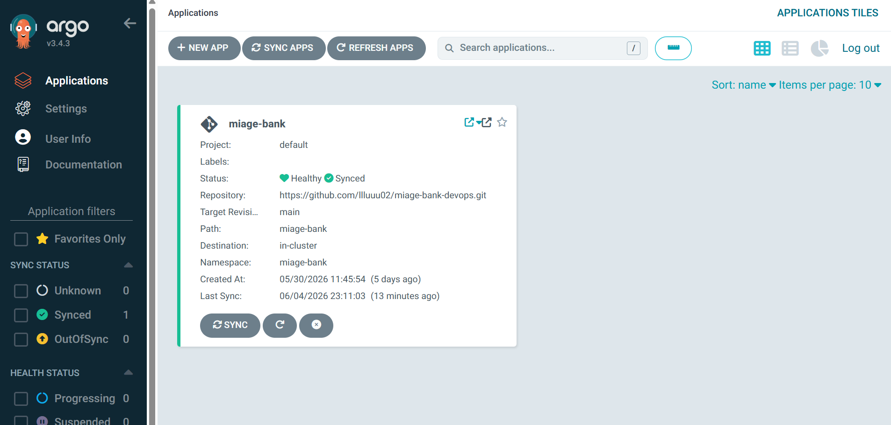
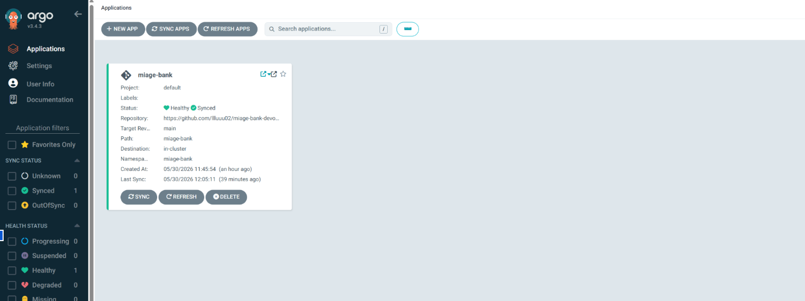
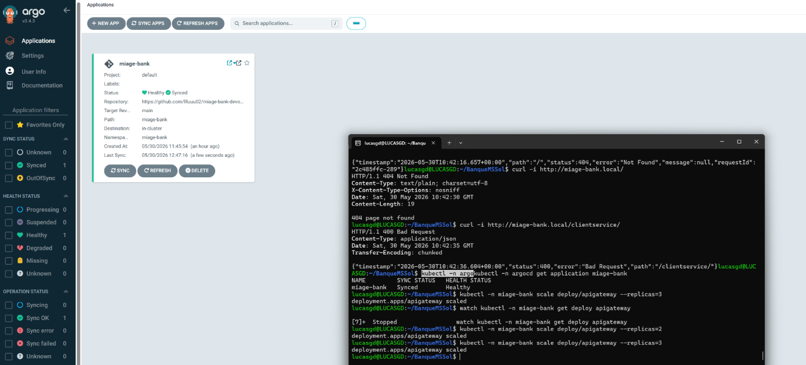

# GitOps avec ArgoCD

---

## Mise en place

```bash
kubectl create namespace argocd
kubectl apply -n argocd -f https://raw.githubusercontent.com/argoproj/argo-cd/stable/manifests/install.yaml
kubectl -n argocd rollout status deploy/argocd-server

# Application ArgoCD pointant sur le dépôt
kubectl apply -f argocd/application.yaml
```

L'`Application` (`argocd/application.yaml`) cible la branche `main`, le chemin
`miage-bank/`, avec synchronisation automatique :

```yaml
syncPolicy:
  automated:
    prune: true
    selfHeal: true
  syncOptions:
    - CreateNamespace=true
```

> **Choix d'organisation** : l'`Application` ArgoCD est dans un dossier `argocd/`
> séparé, pas dans le chart `miage-bank`. La mettre dans le chart qu'elle déploie
> serait circulaire. Le manifeste est versionné dans Git et appliqué une fois pour
> amorcer le GitOps.




---

## Exercice de dérive

Démonstration de la détection de dérive et de l'auto-réparation :

```bash
# 1) On crée une dérive manuelle : on force apigateway à 3 réplicas
kubectl -n miage-bank scale deploy/apigateway --replicas=3

# 2) ArgoCD détecte la divergence : l'Application passe brièvement "OutOfSync"

# 3) selfHeal: true ré-applique l'état du dépôt Git :
#    apigateway revient automatiquement à 1 réplica, statut "Synced"
kubectl -n miage-bank get deploy apigateway
```
Avant la modif dans le helm :

Pendant la modif dans le helm :

Après la modif dans le helm :


Déroulé observé :
1. **Avant** : `apigateway` à 1 réplica, Application `Synced`.
2. **Après le scale à 3** : l'Application passe `OutOfSync` (l'état réel diverge du Git).
3. **Réconciliation automatique** : `selfHeal` ré-applique le Git, `apigateway`
   revient à **1 réplica**, l'Application repasse `Synced` — sans intervention manuelle.

> L'interface ArgoCD permet de visualiser le passage `OutOfSync` puis le retour à
> `Synced` ; les captures ci-dessus en attestent.